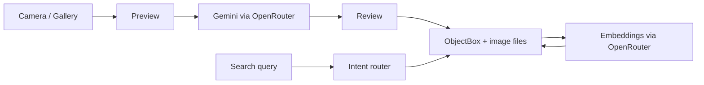

# wara2a

[](https://github.com/TarekMohammedgg/wara2a/actions/workflows/ci.yml)
[](https://github.com/TarekMohammedgg/wara2a/actions/workflows/android-release.yml)
[](https://github.com/TarekMohammedgg/wara2a/releases/latest)

Arabic-first Flutter app for capturing invoices, extracting structured fields in the cloud, reviewing them on device, and searching them later in Arabic or English.

Invoices and images stay in the app sandbox. Extraction and semantic search run through [OpenRouter](https://openrouter.ai) only after the user stores an API key and enables cloud processing.

## Table of contents

- [Background](#background)
- [Features](#features)
- [Architecture](#architecture)
- [Install](#install)
- [Development](#development)
- [Usage](#usage)
- [Configuration](#configuration)
- [Privacy](#privacy)
- [Project structure](#project-structure)
- [Testing](#testing)
- [CI/CD](#cicd)
- [Contributing](#contributing)
- [License](#license)

## Background

wara2a is built for people who keep paper receipts and need to find them later: merchant, date, amount, product, or warranty. The product is a local ledger with optional cloud vision and embeddings, not a cloud-hosted invoice database.

The current Android package is `com.tarek.wara2a`. Default locale is Arabic, with English available in Settings. Light and dark themes are supported.

## Features

| Area | What it does |
| --- | --- |
| Capture | Camera or gallery, with image validation before processing |
| Extraction | OpenRouter `google/gemini-2.5-flash-lite` turns the photo into structured JSON |
| Review | Edit merchant, date, invoice number, totals, line items, and warranty before save |
| Storage | ObjectBox on device; invoice images stay in the app documents directory |
| Search | Keyword, structured filters, semantic, or hybrid routing from the query text |
| Language | Arabic and English UI, plus Arabic-Indic / Persian digit normalization |
| Settings | Theme, locale, OpenRouter API key in secure storage, explicit cloud consent |

Extracted fields include merchant, purchase date, invoice number, currency, total, product rows, warranty months, and raw text when the model returns it.

Search understands Arabic and English amount, currency, date, and warranty phrases, then routes to:

- **keyword** for identifiers and product names
- **structured** for amount, currency, purchase date, or warranty filters
- **semantic** for descriptive queries using `openai/text-embedding-3-small` (1536-d)
- **hybrid** when a confident filter and remaining text should run together

## Architecture

Feature-first Flutter layout with Cubit/BLoC state, repository interfaces, and a shared `AppDependencies` graph.



| Layer | Choice |
| --- | --- |
| UI | Flutter 3.44, Material 3, `go_router` |
| State | `flutter_bloc` Cubits per feature |
| Local data | ObjectBox schema v4, HNSW vectors for semantic search |
| Cloud | OpenRouter Chat Completions + Embeddings APIs |
| Secrets | `flutter_secure_storage` for the API key |
| Localization | In-app Arabic / English strings |

Detailed development gates live in [docs/development.md](docs/development.md).

## Install

Use this path if you only want to run the app on a phone.

1. Open the [latest GitHub Release](https://github.com/TarekMohammedgg/wara2a/releases/latest).
2. Download `wara2a-*.apk`. Do not install the `.aab` file; that bundle is for Play Store tooling.
3. Allow installs from unknown sources if Android asks.
4. If an older wara2a build was signed with a different key, uninstall it first.

Each default-branch commit publishes a new version such as `1.0.0+N`.

## Development

### Prerequisites

- Flutter **3.44.4** stable (pinned in GitHub Actions)
- Dart SDK **^3.12.2**
- Android SDK with compile SDK 37
- An [OpenRouter API key](https://openrouter.ai) for extraction and semantic search

```powershell
git clone https://github.com/TarekMohammedgg/wara2a.git
cd wara2a
flutter pub get
dart run build_runner build --delete-conflicting-outputs
flutter run
```

ObjectBox code generation is required after entity changes. Persistence tests also need the ObjectBox native library on the host; follow the ObjectBox Dart install notes before `flutter test` if those tests fail to load.

## Usage

1. Open **Settings**.
2. Paste an OpenRouter API key. It is stored in secure storage, not in source or `--dart-define`.
3. Enable **Allow cloud processing**. Extraction and embeddings stay disabled until this is on.
4. On Home, add an invoice from camera or gallery.
5. Confirm the preview, wait for extraction, then review and save.
6. Use Search for names, amounts, dates, warranty phrases, or natural-language descriptions.

Cloud calls are skipped when the key is missing or consent is off.

## Configuration

| Setting | Where | Notes |
| --- | --- | --- |
| OpenRouter API key | Settings | Stored with `flutter_secure_storage` |
| Cloud processing consent | Settings | Required before any OpenRouter request |
| Locale | Settings | `ar` (default) or `en` |
| Theme | Settings | Light or dark |
| Extraction model | Code | `google/gemini-2.5-flash-lite` |
| Embedding model | Code | `openai/text-embedding-3-small`, 1536 dimensions |
| Android application ID | Gradle | `com.tarek.wara2a` |

Play Store signing uses repository secrets documented in [docs/development.md](docs/development.md). Keystores are never committed.

## Privacy

- Invoice rows, search text, and photos are stored locally in the app sandbox.
- Android Auto Backup is disabled for this app.
- When cloud processing is enabled, invoice images and search text may be sent to OpenRouter.
- The API key is not written to SharedPreferences in plaintext; a one-time migration moves any legacy key into secure storage.

## Project structure

```text
lib/
  main.dart
  core/           # routing, theme, ObjectBox, OpenRouter clients, shared widgets
  features/
    home/         # invoice list and capture entry
    invoice_capture/
    invoice_details/
    search/
    settings/
  l10n/           # Arabic and English strings
test/             # unit and repository tests
.github/workflows # CI and Android release
docs/development.md
```

Each feature keeps models, repositories, Cubits, and views together.

## Testing

```powershell
dart format --output=none --set-exit-if-changed lib test
flutter analyze --no-fatal-infos
flutter test
```

CI currently runs the stable unit and repository suites. Two widget flows (`test/widget_test.dart` and `test/features/search/search_view_test.dart`) are excluded from the automated command until they settle reliably.

## CI/CD

| Workflow | Trigger | Result |
| --- | --- | --- |
| Flutter CI | Every push and pull request | Format, analyze, tests, debug APK artifact |
| Android Release | Every commit on the default branch, `v*` tags, or manual run | Versioned release APK/AAB on GitHub Releases |

The release version is `pubspec.yaml` `1.0.0` plus the workflow run number (`1.0.0+N`). See [docs/development.md](docs/development.md) for signing secrets and known CI limits.

## Contributing

This repository does not yet have a separate contributing guide. For local work:

1. Create a branch from the default branch.
2. Keep feature code inside `lib/features/<name>/`.
3. Run format, analyze, and tests before opening a pull request.
4. Do not commit `android/key.properties`, `*.jks`, or API keys.

## License

No license file is published in this repository. Treat the code as all rights reserved unless the owner adds a license.
